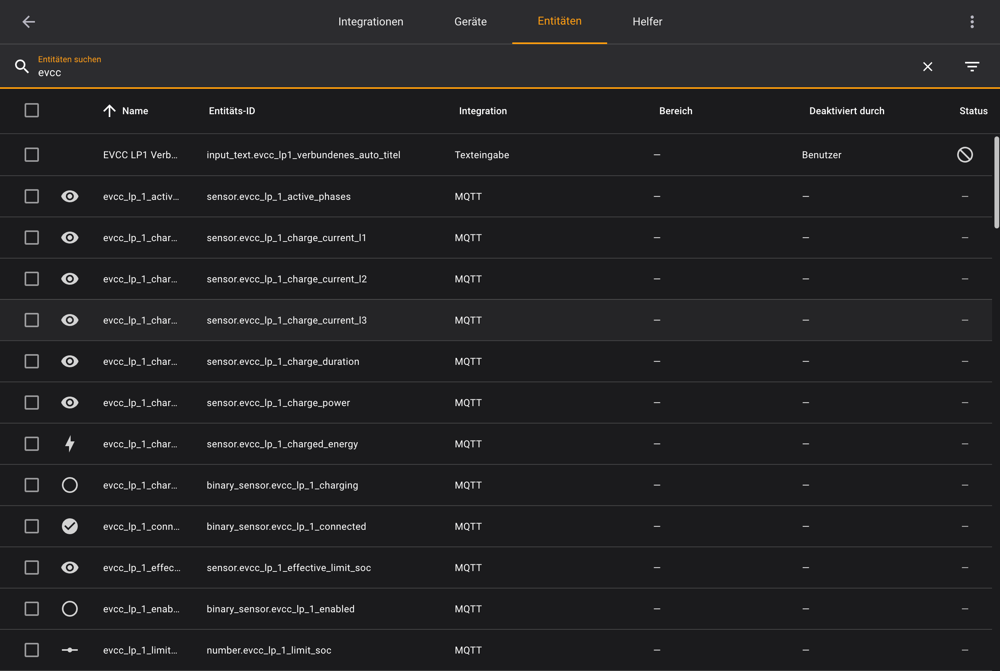
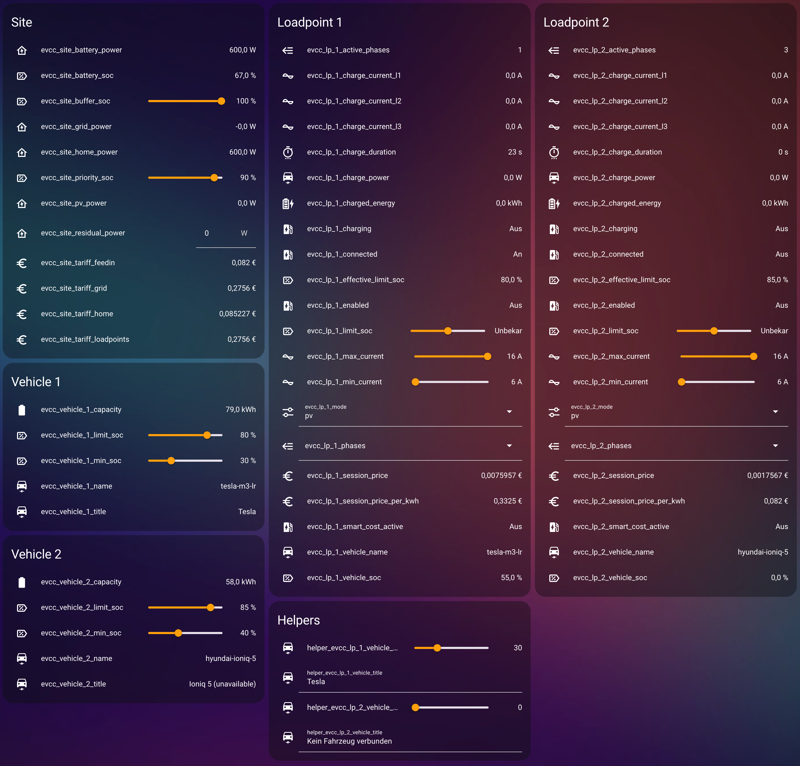

# MQTT Integration für Home Assistant

Konfigurationsdateien für eine MQTT Integration, welche die Basis für alle anderen Puzzleteile ist, welche auf EVCC Entities zugreifen.

Leider aktualisiert EVCC die MQTT Topics sehr dynamisch auch in kleinen Minor-Releases. Wir versuchen mit EVCC Schritt zu halten. Wenn hier etwas nicht tut, bitte schaue zuerst ob Deine EVCC Version aktuell ist. Falls ja, und es tut trotzdem was nicht, kann es sein, dass wir noch nicht hinterhergekommen sind die Konfiguration unten anzupassen. Bitte gebe dann hier einen neuen Issue ein oder noch besser: schicke uns einen Pull Request, damit wir uns darum kümmern können.

## Setup

### packages Verzeichnis einrichten

Falls noch nicht getan, muss in HomeAssistant noch das `packages` Verzeichnis konfiguriert werden - ein Verzeichnis in dem man YAML Dateien ablegen kann, die alle mit der Home Assistant Konfiguration gemerged werden.

1. Folgender Code muss zur configuration.yaml hinzugefügt werden:
    ```yaml
    homeassistant:
      packages: !include_dir_named packages
    ```
2. Unterordner `packages` erstellen

### MQTT Integration installieren

1. Home Assistant öffnen
2. Gehe zu 'Einstellungen > Geräte und Dienste'
3. Unten rechts auf 'INTEGRATION HINZUFÜGEN' klicken
4. Die MQTT Integration hinzufügen:
   

### EVCC MQTT YAMLs installieren

1. Lade die YAML Dateien aus diesem Verzeichnis herunter. **TBD: Wie lade ich die Dateien von GITHUB herunter?**
2. Wenn Du nur eine Wallbox hast, lösche `evcc_loadpoint2_mqtt.yaml`. 
3. Kopiere diese Dateien in das oben erstellte `packages` Verzeichnis.
4. Öffne `evcc_vehicle1_mqtt.yaml` und ersetze dort alle Vorkommen des Fahrzeugnamens (nicht der Titel) durch den Namen Deines Fahrzeuges, wie in Deiner `evcc.yaml` angegeben.
5. Wiederhole das für die `evcc_vehicle2_mqtt.yaml` falls Du ein zweites Fahrzeug hast. Falls nein, lösche diese Datei.
6. Starte Home Assistant neu.
   1. In HomeAssistant öffne die 'Entwicklerwerkzeuge'
   2. Klicke auf 'NEU STARTEN'

Wenn jetzt Home Assistant neu gestartet ist, solltest Du neue Entitäten sehen. Gehe auf 'Einstellungen > Geräte und Dienste', klicke auf den Tab 'Entitäten' und gebe EVCC in der Suche ein.



### TODO: Helper anlegen

### TODO: Automationen um die Helper zu synchronisieren

### EVCC MQTT Entities Dashboard

Optionaler Schritt, den Du nur brauchst, wenn Du eine Übersicht über alle EVCC Entities haben möchtest. Dieser kann sehr hilfreich sein um Entities zu finden, die nicht mehr funktionieren, weil EVCC mal wieder Topics geändert hat.

1. Lege ein neues Dashboard an.
2. Editiere das Dashboard.
3. Klicke oben rechts auf die drei Punkte und wähle 'Raw-Konfigurationseditor' aus.
4. Aus dem Unterordner `entities-dashboard` hier im GitHub, öffne die Datei `evcc-mqtt-entities.yaml`
5. Kopiere den Inhalt dieser Datei in den Raw-Konfigurationseditor des Dashboards und klicke auf Speichern.

Dann solltest Du dieses Dashboard sehen:

