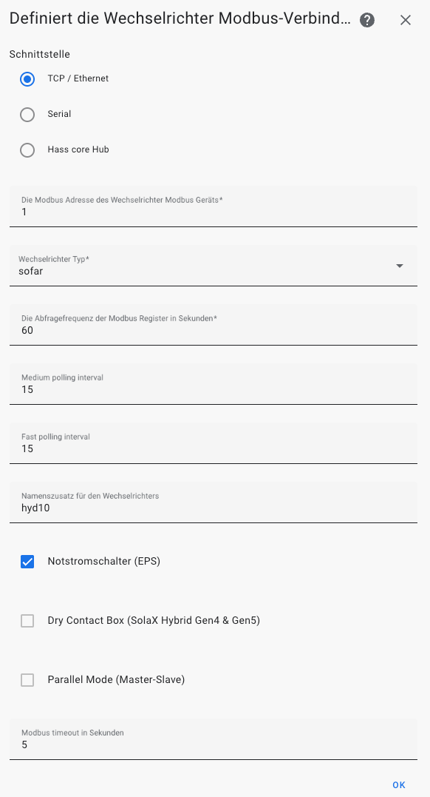

# Sofar HYD x KTL Einrichtung

## Den Wechselrichter verbinden

Die einzige Verbindung, die wir wirklich empfehlen können ist die Verbindung mit einem RS-485 Adapter - entweder seriell direkt an USB oder einen RS485 zu Modbus TCP Adapter. Die Details wie man den Wechselrichter mit EVCC und Home Assistant verbindet findet man hier: https://homeassistant-solax-modbus.readthedocs.io/en/latest/sofar-installation/.

LSE oder LSW sind mit Einschränkungen im 'Transparency' Working Mode auch möglich, jedoch nach unserer Erfahrung längst nicht so zuverlässig wie die direkte RS-485 Verbindung. Der LSE im 'Data Collection' Working Mode können wir inzwischen nicht mehr empfehlen, da hier nach Firmware Upgrades immer wieder Probleme auftauchen und auch die Kommunikation vom Standard abweicht, was immer wieder zu Problemen in Home Assistant führt.

Solltest Du dennoch den Loggerstick vorziehen, beachte bitte unbedingt die Hinweise in der [FAQ](https://homeassistant-solax-modbus.readthedocs.io/en/latest/sofar-faq/).

### Kleine Entscheidungshilfe

- **Anschluss über RS-485 USB Adapter**: Günstigste Lösung, wenn der Rechner oder der Raspberry PI in der Nähe des Wechselrichters aufgestellt werden kann.
- **Anschluss über RS-485 Modbus TCP Adapter**: Wenn mehrere Geräte gleichzeitig auf den Wechselrichter zugreifen sollen und die Daten über das existierende lokale Netzwerk (LAN oder WLAN, je nach Adapter) gelesen werden sollen. Hier muss der Rechner oder der Raspberry PI auf dem EVCC und HomeAssistant läuft nur irgendwo im selben Netzwerk sein. Die Adapter haben oft auch schon eine sehr gute, eingebaute Fehlerkorrektur.
- **LSW-3 oder LSE-3 Logger Stick über Transparency Working Mode**: Am einfachsten einzurichten, da keine spezielle Verdrahtung notwendig. Jedoch einige Nachteile. Funktioniert mit neuerer Firmware nicht mehr.
- **LSW-3 mit Modbus TCP**: Funktioniert nur ab einer bestimmten Firmware version von Wechselrichter und LSW. Siehe https://homeassistant-solax-modbus.readthedocs.io/en/latest/sofar-installation/


## Wechselrichter in EVCC einbinden

Siehe die Dokumentation von EVCC: https://docs.evcc.io/docs/devices/meters#hyd-520k-3ph. Mittlerweile kann die Konfiguration über die Benutzeroberfläche interaktiv erfolgen, wenn man in EVCC die Experimental Features aktiviert.

Bei der Benutzung eines seriellen USB Adapters empfehlen wir in in EVCC einen [ModBus Proxy einzurichten](https://docs.evcc.io/docs/reference/configuration/modbusproxy) (bei einem Modbus TCP Adapter übernimmt die Adapter diese Rolle). Für eine serielle USB Verbindung kann die Konfiguration dann zum Beispiel so aussehen:

```yaml
modbusproxy:
  - port: 5021
    device: /dev/ttyUSB0
    comset: 8N1
    baudrate: 9600
```

Will man den LSW oder LSE im 'Transparency' Working Mode nutzen, muss sogar unbedingt ein Modbus Proxy verwendet werden, da Modbus RTU keine parallelen Zugriffe erlaubt. Es wird sonst zu Konflikten kommen. Die Konfiguration des Modbus Proxy kann dann z.B. so aussehen (IP Adresse ist durch die IP des Logger Sticks zu ersetzen):

```yaml
modbusproxy:
  - port: 5021
    uri: 192.168.158.13:8899
    rtu: true
```

Wichtig ist nun, dass die EVCC Meter Konfiguration UND HomeAssistant beide sich auf diesen ModBus Proxy von EVCC verbinden, damit der ModBus Proxy bei parallelen Zugriffen zwischen den beiden zugreifenden Diensten vermitteln kann. In EVCC wird die Verbindung im UI dann so konfiguriert:


Die IP Adresse ist dabei durch die Adresse des Gerätes auf dem EVCC mit dem ModBus Proxy läuft, zu ersetzen.


## Wechselrichter in Home Assistant einbinden

Der Wechselrichter wird über die SolaX (ja richtig gelesen - die SolaX Integration unterstützt auch Sofar Wechselrichter) Integration eingebunden.

### Home Assistant Community Store 

Die notwendige Integration ist eine Community Integration. Daher muss erstmal der Community Store (HACS) in Home Assistant eingerichtet werden, falls noch nicht getan.

Installation wie hier: https://hacs.xyz/docs/setup/download/.

Im HomeAssistant sollte nun links ein neuer Menüpunkt 'HACS' auftauchen.

### SolaX Integration via HACS installieren

1. Öffne HomeAssistant in Deinem Browser und gehe auf 'HACS' im Menü.
2. Klicke auf 'Integrationen'.
3. Klicke unten rechts auf 'DURCHSUCHEN UND HERUNTERLADEN VON REPOSITORIES'.
4. Unter 'Suche nach Repository' gebe 'solax' ein.
5. Clicke auf 'SolaX Interter Modbus'
6. Unten rechts auf 'HERUNTERLADEN' klicken.

Danach einmal Home Assistant neu starten (am besten auf Entwicklerwerkzeuge und auf der ersten Seite findet ihr schon den roten Link zum Neustart).

### Einrichtung

**Erste Seite:**

- Schnittstelle: TCP/Ethernet
- Modbus Adresse: 1
- Wechselrichter Typ: sofar
- Abfragefrequenz: 60 Sekunden (oder länger, aber nicht kürzer)
- Medium polling interval: 30 Sekunden (eigentlich egal, da es keine Entities für Sofar gibt, die das Medium polling interval nutzen)
- Fast polling interval: 15 Sekunden
- Namenszusatz für den Wechselrichter: Kann beliebig gewählt werden, sollte aber möglichst kurz sein oder leer.

Setze die Checkboxen, je nachdem welche Features Dein Wechselrichter unterstützt - ist für unseren Fall aber alles optional.



Auf 'OK' klicken. Nun muss die TCP/IP Schnittstelle für ModBus TCP konfiguriert werden:

**Zweite Seite:**

- Gebe die IP Adresse und Port an.
  - EVCC Modbus Proxy: Die IP Adresse des Gerätes auf dem EVCC installiert ist und den Port des Modbus Proxy (z.B. 5021).
  - RS485-Modbus TCP Adapter: IP Adresse des Adapters und den entsprechenden Port.
- tcp_type: Modbus TCP


**Dritte Seite:**

Nun kann man noch wählen ob man das Auslesen der Batteriemodule aktivieren will. Dies ist für manche Automatisierungen notwendig und sollte aktiviert bleiben. Nochmals auf 'OK' klicken.

Nun sollte unter der Integration 1 Gerät für den Wechselrichter und jeweils ein Gerät pro Batteriemodul auftauchen. Klicke mal darauf.

Wenn die Steuerelemente und Entities noch nicht mit Werten gefüllt sind, habe etwas Geduld. Das kann dauern. Weiter unten unter 'Sensoren' werden dann irgendwann auch mal jede Menge Werte des Wechselrichters angezeigt.

