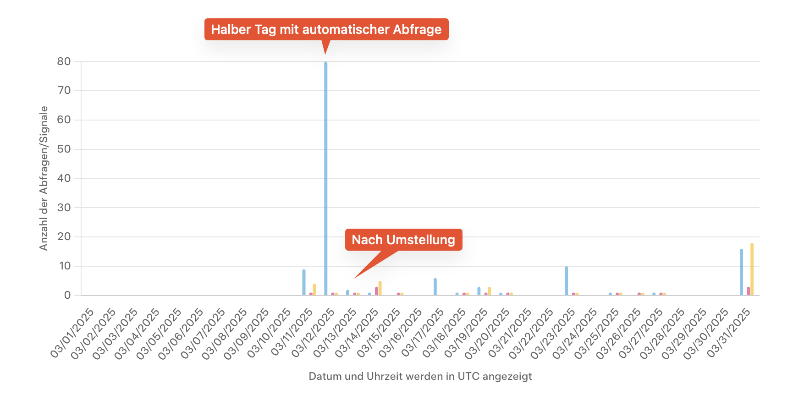
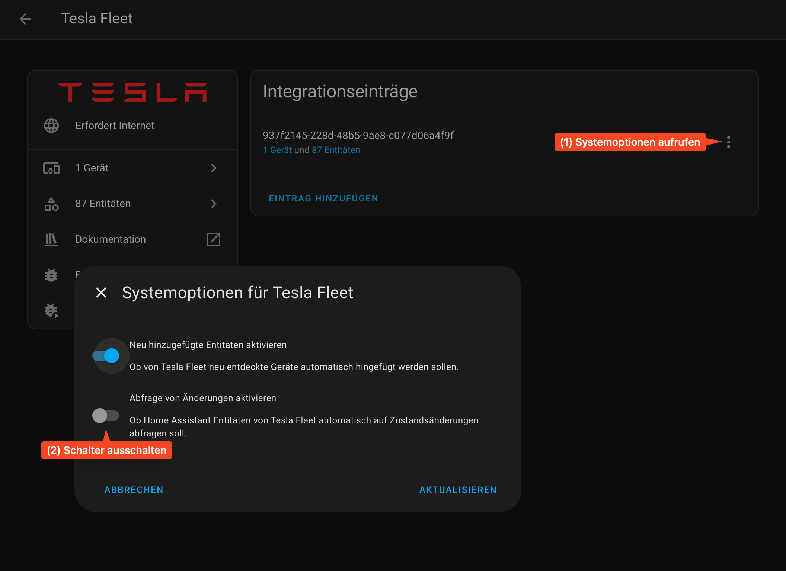

# Tesla Entities manuell aktualisieren

Seit Februar 2025 hat Tesla das Benutzen der Fleet API auf ein kostenpflichtiges Model umgestellt. Jeder Kunde hat ein Kontingent von 10 Euro pro Monat. Gerade im Zusammenspiel mit EVCC kann dieses sehr schnell knapp werden.

Mit dieser Methode wird die automatische Aktualisierung der Entities, welche schnell mehr als 100 Abfragen am Tag verbraucht, durch eine manuelle Methode ersetzt. Die Tesla Fleet API ist hiermit zwar nicht mehr zur laufenden Überwachung des Teslas geeignet. Aber für Scripte und Automationen mit Einschränkungen immer noch zu gebrauchen.

## Tesla Fleet Integration

Die Tesla Fleet Integration muss nun wie EVCC mit einer eigenen Client ID aufgesetzt werden. **Es darf NICHT dieselbe Client ID von EVCC nochmals wiederverwendet werden.** Ich empfehle daher sehr im [Tesla Developer Dashboard](https://developer.tesla.com/de_DE/dashboard) für Home Assistant neben EVCC eine zweite App zu registrieren um die beiden Accounts sauber zu trennen. Das hilft auch sehr bei der Kostenkontrolle.

Die Konfiguration der Tesla Fleet Integration wird im Detail auf der [Tesla Fleet Integration Configuration](https://www.home-assistant.io/integrations/tesla_fleet/#configuration) Seite beschrieben. Mit [fleetkey.cc](https://fleetkey.cc/) kann man sich die Einrichtung deutlich erleichtern.

Viel Glück bei der Einrichtung.

> [!WARNING]
> Fleetkey.cc speichert keine Daten. Bei jedem Aufruf wird eine neue URL erzeugt. Während der Einrichtung die Fleetkey.cc Seite unbedingt offen lassen und nicht neu laden, bis **alle** Schritte, einschließlich dem Registrieren des virtuellen Schlüssels mittels QR Code ganz am Ende, abgeschlossen worden sind und im Anschluss die Integration erfolgreich getestet worden ist.

Nach der Einrichtung bitte einmal testen, ob Befehle ausgeführt werden können:
1. Mittels der Integration den Tesla aufwecken.
2. Mittels der Integration einen Befehl schicken (zum Beispiel Kofferraum öffnen)

Wenn die Tesla Fleet Integration dann endlich korrekt aufgesetzt ist, empfehle ich die automatische Abfrage von Änderungen wegen dem hohen Datenaufkommen zu deaktivieren. Dazu unter 'Geräte und Dienste' die 'Tesla Fleet' Integration öffnen und mit folgenden Schritten die automatische Abfrage von Änderungen deaktivieren:

Nun werden keine Entitäten mehr automatisch aktualisiert.

## Update Entities Script

Hier kommt nun das [Update Entities Script](./update-entities.yaml) zum Einsatz. Immer wenn man in einer Automatisierung bestimmte Werte von Entities abfragen muss, ruft man einfach dieses Script vorher auf.

Das Script
1. Weckt den Tesla auf, falls notwendig.
2. Aktualisiert die Entities, die man braucht. Diese Liste ist je nach Automatisierung um die Entities aus der Tesla Fleet API zu erweitern, die man in den Automatisierungen abfragt um sicher zu gehen, dass alle Entities aktualisiert worden sind.

### Anpassungen
- Im Script sind generell alle Entities durch den Namen Eures Tesla anzupassen. Ersetzt `<fahrzeug_id>` durch den Namen, den die Tesla Fleet Integration für Euren Tesla vergeben hat.
- Fügt die Entities der Tesla Fleet Integration hinzu, die ihr nach Aufruf abfragen wollt.
