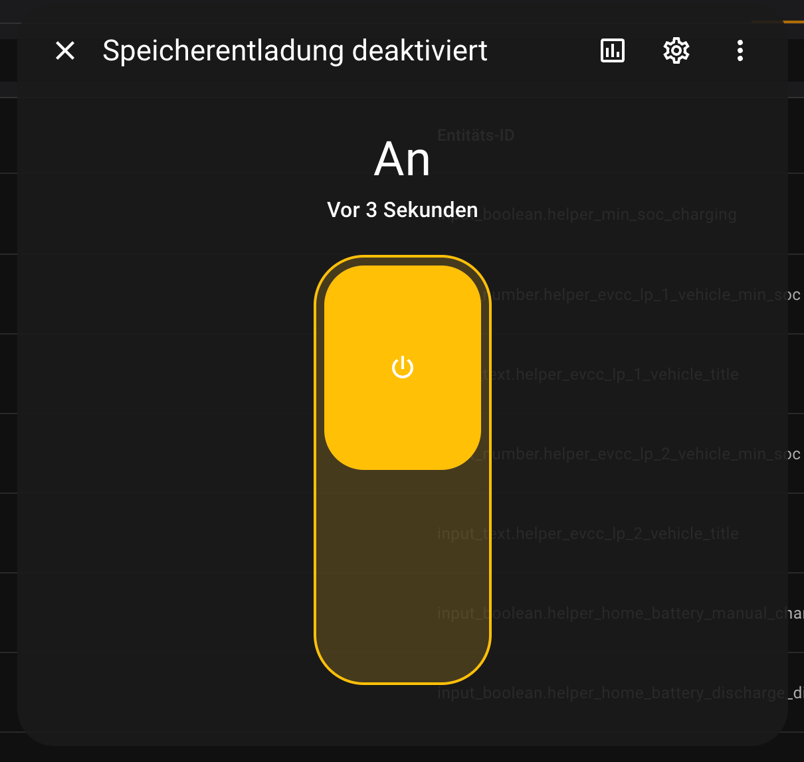

# Heimspeicher: Entladung deaktiveren

Erlaubt es die Entladung des Hausspeichers zu deaktivieren. Zum Beispiel um während einer schnellen Autoladung den Speicher nicht unnötig zu leeren.

## Helfer

Für die Automatisierungen in den Unterordnern muss folgender Helper angelegt werden:

- Typ: Schalter
- Name:  `helper_home_battery_discharge_disabled`

## Automatisierungen

Automatisierungen mit Hilfe der YAML Dateien aus den entsprechenden Unterordnern für den passenden Wechselrichter anlegen.

## Test

Nachdem untenstehender Helfer angelegt wurde und die Automatisierungen für den entsprechenden Wechselrichter aus den entsprechenden Unterordnern eingerichtet worden sind, kann der Speicher schon manuell ein- und ausgeschaltet werden.

1. Unter `Geräte und Dienste` auf den Helfer Tab gehen
2. Auf obigen Helfer klicken
3. Schalter umlegen so, dass er auf An geht.
4. Nach einer gewissen Wartezeit sollte der Speicher keinen Strom mehr abgeben.
3. Schalter auf Aus umlegen.
4. Nach einer gewissen Wartezeit sollte der Speicher wieder Strom liefern.

