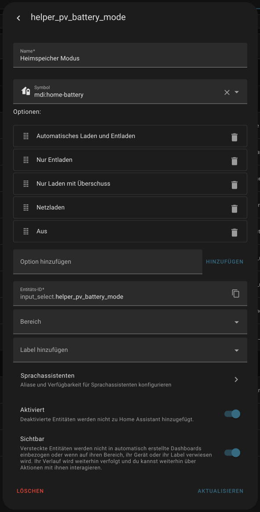
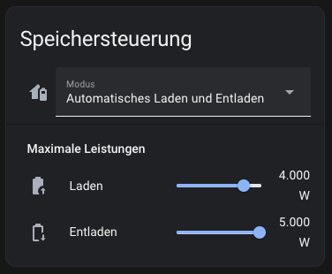
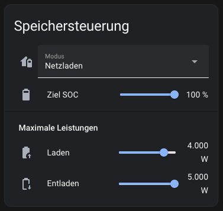

> [!NOTE]  
> 2025-06-15: Neu: Maximale Lade- und Entladeströme festlegen.

# Heimspeicher steuern

Erlaubt es den Heimspeicher zu steuern:
- Automatisches Laden und Entladen: Der Heimspeicher lädt und entlädt nach Bedarf.
- Nur Entladen: Der Heimspeicher entlädt nach Bedarf, aber eine Ladung wird blockiert.
- Nur Laden: Der Heimspeicher lädt sich bei PV Überschuss auf. Eine Entladung wird aber blockiert.
- Netzladen: Der Heimspeicher wird aus dem Netz aufgeladen.
- Aus: Der Speicher lädt und entlädt sich nicht.

## Helfer

[Grundlagen zu Helfern](../../README.md#helfer).

Für die Automatisierungen und Skripte in den Unterordnern müssen folgende Helfer angelegt werden:

### Modus Dropdown


- Typ: Dropdown-Menü
- Name beim Anlegen/Entitäts-ID:  `helper_pv_battery_mode`
- Optionen:
  - Automatisches Laden und Entladen
  - Nur Entladen
  - Nur Laden
  - Netzladen
  - Aus

Nachdem er gespeichert und angelegt und die Entity ID vergeben wurde, empfehle ich den Helfer nochmals aufzumachen um ihm dann einen Benutzerfreundlicheren Namen und Icon zu geben:



### Zielladestand

- Typ: Zahlenwert-Eingabe
- Name beim Anlegen/Entitäts-ID:  `helper_pv_battery_target_soc`
- Minimalwert: 20
- Maximalwert: 100
- Erweiterte Einstellungen
  - Anzeigemodus: Schieberegeler
  - Schrittweite: 1
  - Maßeinheit: %

Auch hier empfiehlt es sich nach dem ersten Anlegen den Helfer nochmals zu öffnen und Namen und Icon zu vergeben.

### Maximale Ladeleistung

- Typ: Zahlenwert-Eingabe
- Name beim Anlegen/Entitäts-ID:  `helper_pv_battery_max_charge_power`
- Minimalwert: 0
- Maximalwert: \<maximale Ladeleistung des Speichers\>
- Erweiterte Einstellungen
  - Anzeigemodus: Schieberegeler
  - Schrittweite: z.B. 500
  - Maßeinheit: W


### Maximale Entladeleistung

- Typ: Zahlenwert-Eingabe
- Name beim Anlegen/Entitäts-ID:  `helper_pv_battery_max_discharge_power`
- Minimalwert: 0
- Maximalwert: \<maximale Entladeleistung des Speichers\>
- Erweiterte Einstellungen
  - Anzeigemodus: Schieberegeler
  - Schrittweite: z.B. 500
  - Maßeinheit: W

## Automatisierungen & Skripte

[Grundlagen um Automatisierungen zu erstellen](../../README.md#home-assistant-artefakte).

Automatisierungen mit Hilfe der YAML Dateien aus den entsprechenden Unterordnern für den passenden Wechselrichter anlegen.

Siehe die 'README.md' Datei dort für mehr Informationen.

## Dashboard Widget

Optional kann nun auch ein Widget zu einem Lovelace Widget hinzugefügt werden, mit dem der Speicher bequem gesteuert werden kann.





Zum Anlegen:
1. Ein neues Entitäten Widget zum Dashboard hinzufügen.
2. Unten links auf `CODE-EDITOR ANZEIGEN` klicken.
3. Den Inhalt durch untenstehendes YAML ersetzen.

```yaml
type: entities
entities:
  - entity: input_select.helper_pv_battery_mode
    name: Modus
  - type: conditional
    conditions:
      - entity: input_select.helper_pv_battery_mode
        state: Netzladen
    row:
      entity: input_number.helper_pv_battery_target_soc
      name: Ziel SOC
  - type: section
    label: Maximale Leistungen
  - entity: input_number.helper_pv_battery_max_charge_power
    name: Laden
  - entity: input_number.helper_pv_battery_max_discharge_power
    name: Entladen
title: Speichersteuerung
```

