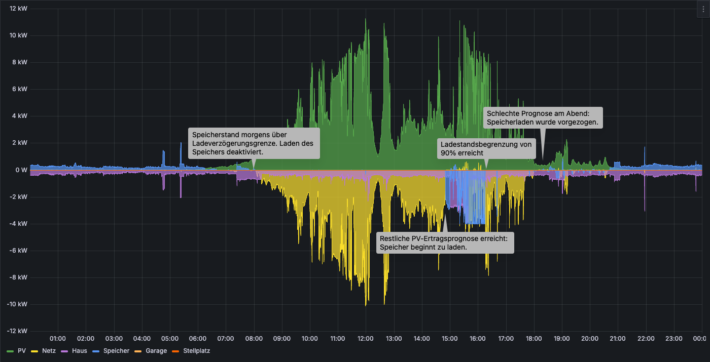
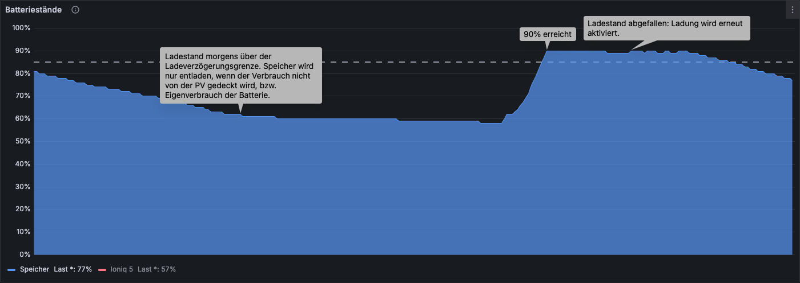

# Speicheroptimierung

Ziele dieser Speicheroptimierung sind:

- Verlängerung der Batterielebensdauer durch reduzierte 100% Zeiten:
  - Verzögertes Aufladen, damit der Speicher nicht schon am Morgen voll ist und nur auf den Abend wartet um entladen zu werden.
  - An Tagen mit ausreichend Ertrag wird der maximalen Ladestand limitiert. Dabei wird jedoch sichergestellt, dass nach einigen Tagen doch wieder auf 100% geladen wird damit das Batterie Management des Speichers den Ladestand wieder kalibrieren kann und die Zellen ausbalanciert werden. Dies ist besonders für Lithium Eisenphosphat (LFP) Batterien wichtig, wegen ihrer sehr flachen Spannungskurve.
- EVCC wird während dessen so gesteuert, dass parallel mit Überschuss ladende Fahrzeuge optimal geladen werden.
- Ein etwas netzdienlicheres Verhalten. Morgens kann noch eingespeist werden. Erst zum späten Nachmittag wird der Speicher geladen - dann wenn die meisten anderen PV Anlagen einspeisen.
- Optionale Begrenzung der maximalen Lade- und Entladeleistungen (siehe [Heimspeicher steuern](../heimspeicher-steuern/README.md)).

Was diese Steuerung (derzeit noch) nicht kann:
- Regelung nach Stromspitzengesetz: Überschuss über mehr als 60 Prozent in den Speicher laden.
- Laden bei negativen Strombörsenpreisen.

## Beschreibung

Moderne Energiemanagementsysteme nutzen zum Teil KI und Machine Learning um den Verbrauch des Hauses zu lernen und um den Speicher zu steuern. Mit dieser Steuerung verbleibt die volle Kontrolle beim Benutzer - dies erfordert allerdings einige Parameter, die recht individuell sind. Diese sind abhängig von

- Hausverbrauch und typisches Verbrauchsverhalten der Bewohner.
- Verhältnis von PV Leistung zu Speichergröße, sowie die Ausrichtung der PV Anlage.

Um die Parameter einzustellen wird hier eine [Karte](#steuerung) bereitgestellt, um alle Parameter bequem einstellen zu können.


Hier sieht man Beispielsweise meine Einstellungen für eine PV Anlage mit 9,84 kWp, die nach Süden ausgerichtet ist mit einem Speicher von 10 kWh, der auf eine Entladegrenze von 10% eingestellt ist. Mit diesen Einstellungen wurde bisher mein Speicher jeden einzelnen Tag rechtzeitig voll. Wie sich dies im Winter bewährt, wird sich noch sehen lassen.

Die Einstellungen im Einzelnen:

| Parameter | Beschreibung |
| --------- | ------------ |
| Speicheroptimierung aktiv | Wenn an, wird die Speicherladung optimiert. |
| Guter Tag ab Prognose     | Der Ertrag in kWh, ab wann man von einem ausreichend guten Tag reden kann, der einen guten Autarkiegrad ergibt, während der Speicher noch sicher vollgeladen wird.<br>Anhand dieses Wertes wird entschieden ob eine verzögerte Speicherladung an diesem Tag überhaupt durchgeführt wird, oder ob das Wetter eher zu unbeständig ist. Es könnte ja sein, das früh am morgen zwar die Sonne scheint, später das Wetter jedoch umschlägt. Dann würde der Speicher nicht mehr voll werden.<br>Darüber hinaus wird die Ladestandsbegrenzung ignoriert, wenn die Prognose für den nächsten Tag unter diesem Wert liegt, denn man wird womöglich am nächsten Tag jede kWh aus dem Speicher benötigen. |
| Laden verzögert ab SoC    | Ab diesem Ladestand wird verzögert. Ist der Ladestand bei Sonnenaufgang darüber wird die weitere Ladung deaktiviert. Ist der Ladestand bei Sonnenaufgang noch darunter wird zunächst auf diesen Ladestand geladen. Er sollte hoch genug gewählt sein, damit der Speicher eventuelle Verbrauchsspitzen, die nicht von der PV ausgeglichen werden können (z.B. Kochen am Mittag) abdecken kann. |
| Laden erlaubt ab SoC      | Sollte während das Laden noch verzögert wird, der Speicher zu stark abfallen, wird die Speicherladung ab diesem Ladestand wieder erlaubt. Dann wird wieder bis zum 'Laden verzögert ab SoC' Ladestand geladen. Entsprechend muss dieser Ladestand niedriger gewählt werden. Er sollte etwas über der Entladegrenze des Speichers liegen (zum Beispiel, wenn die Entladegrenze bei 20% liegt, dann sollte dieser Wert bei mindestens 25% liegen) |
| Start ab PV Restprognose  | Ab dieser restlichen Prognose würde die Ladung des Speicher gestartet werden, wenn er von 0% auf 100% geladen werden würde. Der Wert sollte also so gewählt werden, dass neben der Speicherladung auch noch der Hausverbrauch locker abgedeckt wird. Hierbei sollte man vom Worst Case ausgehen, also zum Beispiel es wird gebacken, während Spülmaschine, Waschmschine und Trockner läuft. Dieser Wert lässt sich am besten durch probieren herausfinden. Am besten startet man als Faustregel mit 2.5 x Speicherkapazität (bei einem 10 kWh Speicher, also 25 kWh Restprognose) und reduziert dann wenn man merkt, dass der Speicher auch später geladen werden könnte.<br>Desto höher der Ladestand ist, desto mehr wird der Start automatisch anteilhaft verzögert. Muss der Speicher also z.B. nur um 50% geladen werden, wird die Ladung erst ab einer kleineren Restprognose gestartet.|
| Benachrichtigungen aktiv  | Während man die Werte noch einstellt kann man sich zur besseren Überwachung Benachrichtungen über die Home Assistant Companion App schicken lassen. Wenn die Werte einmal gut eingestellt sind, kann man diese Benachrichtigungen mit diesem Schalter abschalten |
| Begrenzung aktiv          | Aktiviert die Ladestandsbegrenzung zum eingestellten Wert. Wenn abgeschaltet wird immer auf 100% geladen |
| Maximaler Ladestand       | Der Ladestand auf den der Speicher maximal geladen werden soll, vorausgesetzt der nächste Tag hat eine ausreichend gute Prognose. |
| Vollladen nach Tagen      | Nach dieser Anzahl an Tagen wird der Speicher mindestens einmal auf 100% geladen, damit das Batteriemanagement wieder den Ladestand der LFP Zellen kalibrieren kann. Dies kann gerade im Sommer während vieler guten Sonnentage in Folge vorkommen.<br>Im Winter kann nun das Gegenteil eintreten. Gerade nach den Tagen mit begrenzter Ladung schlägt das Wetter um und der Speicher wird nicht mehr voll. Dann wird spätestens nach 30 Tagen eine Vollladung aus dem Netz erzwungen. |

Weiterhin lassen sich die maximalen Lade- und Entladeleistungen begrenzen (siehe [Heimspeicher steuern](../heimspeicher-steuern/README.md)). Ich begrenze so die maximalen Ladeleistung auf 4 kW um EVCC bei guter Abendsonne parallel noch zu erlauben ein angeschlossenes Auto mit Überschuss zu laden, da sonst recht häufig die Mindestleistung für das Autoladen von 1.4 kW nicht erreicht wird und dann während der Batterieladung eingespeist wird.

### Beispieltag



Kein perfekter Tag. Morgens noch relativ viel Sonne, am Abend sind jedoch dunkle Wolken aufgezogen. Entsprechend ist die restliche Ertragsprognose früher abgefallen und der Ladevorgang des Speichers wurde etwas früher um ca. 14:50 Uhr als an einem schönen Sonnentag gestartet.

Auch sieht man schön, dass wir an diesem Tag sehr spät gekocht haben - etwa um 15:00 Uhr. Dank der höheren Restprognose zum Laden bestand aber mehr als ausreichend Reserve, damit die Ladegrenze noch vor den dunklen Wolken am Abend erreicht wurde. Hätte ja sein können, dass die Spülmaschine noch laufen gemusst hätte.



Ohne dieser Optimierung wäre der Speicher jedoch schon locker um 11:00 Uhr auf 100% geladen gewesen und der Speicher wäre fast den ganzen Tag auf 100% voll gewesen ohne gebraucht zu werden. Und das Netz freut sich über die Einspeisung am morgen, wenn alle anderen PV Speicher noch laden.

Die Grafiken stammen aus den [evcc-grafana-dashboards](https://github.com/ha-puzzles/evcc-grafana-dashboards).

## Abhängigkeiten

- [Heimspeicher steuern](../heimspeicher-steuern)
- [Solcast PV Prognose](https://github.com/BJReplay/ha-solcast-solar) (Die Forecast.Solar Integration von Home Assistant liefert viel zu schlechte Prognosen)
- Home Assistant Companion App auf dem Smartphone, um Benachrichtigungen zu erhalten.
- Optional: [EVCC MQTT Integration](../../../installation/evcc-mqtt-integration/)

## Helfer

[Grundlagen um Helfer zu erstellen](../../../README.md#helfer).

Für die Automatisierungen müssen die folgenden [Helfer](../../../README.md#helfer) angelegt werden:

> [!NOTE]
> - Anzeigenamen für nicht-interne Helfer müssen nicht unbedingt festgelegt werden, da sie in den Widgets sowieso überschrieben werden. Falls die Helfer aber auf eigenen Dashboards genutzt werden wollen, können die Anzeigenamen hilfreich sein.
> - Minimal und Maximalwerte sowie Schrittweiten sind teilweise Erfahrungswerte, die für meine 9.84 kWp Anlage mit 10 kWh Speicher passen. Bitte diese so ändern, dass sie für Deine Anlage sinnvoll sind. Die Werte können jederzeit auch nachträglich im Helfer angepasst werden.
> - Für einige Einstellungen muss in den Benutzereinstellungen der 'Erweiterter Modus' aktiv sein.

### Wechselrichter spezifische Helfer

Lege die Helfer für den entsprechenden Wechselrichter aus den Unterordnern an:
- [Sofar Solar](./sofar-solar-HYD-x-KTL/README.md)

Für andere Wechselrichter diesen Helfer einfach abändern. Wichtiger ist, dass [Heimspeicher steuern](../heimspeicher-steuern) so ähnlich für Deinen Wechselrichter funktioniert.

### helper_speicheroptimierung_battery_lesefehler

Ein internes Flag um potentielle Lesefehler beim Auslesen des Ladestandes zu erkennen. Falls ein kurzzeitiger Lesefehler den Ladestand des Speichers auf 0 setzt, würden hier einige Automationen sofort triggern. Mit Hilfes dieses Flags können die Automationen das verhindern.

- Typ: Schalter
- Name beim Anlegen/Entitäts-ID:  `helper_speicheroptimierung_battery_lesefehler`

### helper_speicheroptimierung_restenergie_aktuell

Ein interner Helfer, der die aktuelle, tatsächliche Restprognose für den Ladestart berechnet anhand der eingestellten maximalen Restprognose und des aktuellen Speicherstandes des Heimspeichers. Hierbei wird der Speicherstand zu 50% mit eingerechnet um einen festen Puffer zu haben.

- Typ: Template für einen Sensor
- Name beim Anlegen/Entitäts-ID:  `helper_speicheroptimierung_restenergie_aktuell`
- Zustandstemplate:
  ```jinja
  

  
    
  
    
  
    
  

  {# 
    Take 50% from remaining battery capacity that needs to be charged + 50% buffer
  #}
  {{ remaining_total * ( (bat_target_soc - bat_soc)/100) * 0.5 + remaining_total * 0.5}}
  ```
- Maßeinheit: kWh
- Geräteklasse: - leer -
- Zustandsklasse: - leer -

### helper_speicheroptimierung_today_max_soc

Interner Zahlenwert, der sich merkt welchen maximalen Ladestand der Speicher heute erreicht hat. 

- Typ: Zahlenwert-Eingabe
- Name beim Anlegen/Entitäts-ID:  `helper_speicheroptimierung_today_max_soc`
- Minimalwert: 0
- Maximalwert: 100
- Erweiterte Einstellungen
  - Anzeigemodus: Eingabefeld
  - Schrittweite: 1
  - Maßeinheit: %

### helper_speicheroptimierung_verzoegertes_laden_aktiv

Ein internes Flag für die Automatisierungen um zu erkennen ob derzeit das Laden des Speichers noch aktiv verzögert wird.

- Typ: Schalter
- Name beim Anlegen/Entitäts-ID:  `helper_speicheroptimierung_verzoegertes_laden_aktiv`

### helper_speicheroptimierung_batterie_nicht_voll_zahler

Ein interner Zähler, der die Tage zählt seit dem der Speicher zum letzten Mal auf 100% geladen worden ist.

- Typ: Zahlenwert-Eingabe
- Name beim Anlegen/Entitäts-ID:  `helper_speicheroptimierung_batterie_nicht_voll_zahler`
- Minimalwert: 0
- Maximalwert: 365
- Erweiterte Einstellungen
  - Anzeigemodus: Eingabefeld
  - Schrittweite: 1
  - Maßeinheit: Tage

### Speicheroptimierung aktiv

- Typ: Schalter
- Name beim Anlegen/Entitäts-ID:  `helper_speicheroptimierung_ein`
- Anzeigename: `Speicheroptimierung aktiv`

### Speicheroptimierung: Benachrichtigungen

- Typ: Schalter
- Name beim Anlegen/Entitäts-ID:  `helper_speicheroptimierung_benachrichtigungen`
- Anzeigename: `Speicheroptimierung: Benachrichtigungen`

### Speicheroptimierung: Ertragslimit eines guten Tages

- Typ: Zahlenwert-Eingabe
- Name beim Anlegen/Entitäts-ID:  `helper_speicheroptimierung_limit_guter_tag_prognose`
- Anzeigename: `Speicheroptimierung: Ertragslimit eines guten Tages`
- Symbol: mdi:weather-sunny
- Minimalwert: 20
- Maximalwert: 50
- Erweiterte Einstellungen
  - Anzeigemodus: Schieberegler
  - Schrittweite: 1
  - Maßeinheit: kWh

### Speicheroptimierung: Ladelimit

- Typ: Zahlenwert-Eingabe
- Name beim Anlegen/Entitäts-ID:  `helper_speicheroptimierung_limit_soc_grenze`
- Anzeigename: `Speicheroptimierung: Ladelimit`
- Symbol: mdi:home-battery
- Minimalwert: 70
- Maximalwert: 100
- Erweiterte Einstellungen
  - Anzeigemodus: Schieberegler
  - Schrittweite: 5
  - Maßeinheit: %


### Speicheroptimierung: Laden einschalten bei min SoC

- Typ: Zahlenwert-Eingabe
- Name beim Anlegen/Entitäts-ID:  `helper_speicheroptimierung_min_soc_laden_aktivieren`
- Anzeigename: `Speicheroptimierung: Laden einschalten bei min SoC`
- Symbol: mdi:home-battery
- Minimalwert: 10
- Maximalwert: 40
- Erweiterte Einstellungen
  - Anzeigemodus: Schieberegler
  - Schrittweite: 5
  - Maßeinheit: %

### Speicheroptimierung: Ladestandsbegrenzung aktiv

- Typ: Schalter
- Name beim Anlegen/Entitäts-ID:  `helper_speicheroptimierung_limit_ein`
- Anzeigename: `Speicheroptimierung: Ladestandsbegrenzung aktiv`

### Speicheroptimierung: PV Restenergie

- Typ: Zahlenwert-Eingabe
- Name beim Anlegen/Entitäts-ID:  `helper_speicheroptimierung_pv_restenergie_kwh`
- Anzeigename: `Speicheroptimierung: PV Restenergie`
- Symbol: mdi:solar-power
- Minimalwert: 15
- Maximalwert: 40
- Erweiterte Einstellungen
  - Anzeigemodus: Schieberegler
  - Schrittweite: 1
  - Maßeinheit: kWh

### Speicheroptimierung: SoC Laden deaktivieren

- Typ: Zahlenwert-Eingabe
- Name beim Anlegen/Entitäts-ID:  `helper_speicheroptimierung_soc_laden_deaktivieren`
- Anzeigename: `Speicheroptimierung: SoC Laden deaktivieren`
- Symbol: mdi:home-battery
- Minimalwert: 15
- Maximalwert: 50
- Erweiterte Einstellungen
  - Anzeigemodus: Schieberegler
  - Schrittweite: 5
  - Maßeinheit: %

### Speicheroptimierung: Vollladen nach Tagen

- Typ: Zahlenwert-Eingabe
- Name beim Anlegen/Entitäts-ID:  `helper_speicheroptimierung_batterie_ladelimit_max_tage`
- Anzeigename: `Speicheroptimierung: Vollladen nach Tagen`
- Symbol: mdi:calendar-range
- Minimalwert: 3
- Maximalwert: 14
- Erweiterte Einstellungen
  - Anzeigemodus: Schieberegler
  - Schrittweite: 1
  - Maßeinheit: Tage


## Skripte

[Grundlagen um Skripte zu erstellen](../../../README.md#home-assistant-artefakte).

### Benachrichtigung senden

[`benachrichtigung.yaml`](./scripte/benachrichtigung.yaml)

Sendet eine Benachrichtigung an die Companion App auf Deinem Smartphone, sofern gewünscht.

#### Notwendige Anpassungen
- `<companion_app_device_name>` ersetzen. Der Gerätename Deines Smartphones auf dem die Companion App läuft um Benachrichtigungen zu erhalten.

### EVCC Priority SoC aktualisieren.

[`evcc-priority-soc-aktualisieren.yaml`](./scripte/evcc-priority-soc-aktualisieren.yaml)

Aktualisiert den Priority SoC von EVCC. Während die Speicheroptimierung verzögert ist und ein Fahrzeug geladen wird, darf der Speicher zur Optimierung de Eigenverbrauches laden. Sonst würde während des Ladevorganges immer wieder eingespeist werden, da die Ladeleistung nur in groben Schritten reguliert wird.

Während des verzögertem Ladens wird der Priority SoC von EVCC wird hierzu auf den minimalen Ladestand, ab dem Laden wieder erlaubt wird, gesetzt. Hiermit wird das Fahrzeug bevorzugt während der verzögerten Ladung geladen und der Heimspeicher erst an zweiter Stelle von dem, was EVCC übrig lässt.

Nach dem verzögerten Laden wird der Priority SoC auf den Standardwert gesetzt sofern keine Ladestandsbegrenzung aktiv ist. Ist eine Ladestandsbegrenzung aktiv, wird der Priority SoC auf den Wert der Ladestandsbegrenzung abzüglich 5% gesetzt, damit das Auto schon etwas vor dem Ladelimit zu laden anfängt um auch hier noch den Eigenverbrauch weiter zu optimieren.

#### Optionale Anpassungen
- Den gewünschten Standardwert von Priority SoC anpassen. Derzeit ist er hier auf 90% gesetzt.


## Automatisierungen

[Grundlagen um Automatisierungen zu erstellen](../../../README.md#home-assistant-artefakte).


### Speicheroptimierung ausgeschaltet

[`speicheroptimierung-ausgeschaltet.yaml`](./automatisierungen/speicheroptimierung-ausgeschaltet.yaml)

Erlaube das Speicherladen, wenn die Optimierung ausgeschaltet wird.

### Erlaube die de-prioritisierte Ladung des Speichers während verzögertem Speicherladen, wenn ein Auto geladen wird

[`evcc-de-prioritiserte-speicherladung.yaml`](./automatisierungen/evcc-de-prioritiserte-speicherladung.yaml)

Erlaube die Speicherladung und passe mittels obigen Script den Priority SoC von EVCC an, wenn während des verzögerten Ladens ein Auto geladen wird.

#### Notwendige Anpassungen

Die Automatisierung ist für 2 Ladepunkte ausgelegt. Bei einem Ladepunkt oder mehr als 2 Ladepunkten, müssen die Bedingungen für die Ladepunkte angepasst werden.

### EVCC Priority SoC aktualisieren

[`evcc-priority-soc-aktualisieren.yaml`](./automatisierungen/evcc-priority-soc-aktualisieren.yaml)

Aktualisiert den EVCC Priority SoC wenn sich einer der Parameter ändert.

### Ladegrenze Monitoren

[`ladegrenze-monitoren.yaml`](./automatisierungen/ladegrenze-monitoren.yaml)

Stellt sicher, dass die eingestellte Ladegrenze gehalten wird nach dem Ende der verzögerten Ladung.

### Laden bei zu niedrigem Speicherstand starten

[`niedriger-speicherstand.yaml`](./automatisierungen/niedriger-speicherstand.yaml)

Wenn der Speicherstand zu stark abfällt, z.B. zu wenig Ertrag und zu hoher Verbrauch während des verzögerten Ladens, erlaube die erneute Ladung des Speichers.

### Laden verzögern bei Erreichen von Ladeabschaltungslimit

[`laden-verzoegern.yaml`](./automatisierungen/laden-verzoegern.yaml)

Sobald die Ladegrenze zum Verzögern der Ladung erreicht wird, wird die weitere Ladung verhindert.

### Nach Sonnenaufgang noch genug Kapazität.

[`sonnenaufgang-ladestand.yaml`](./automatisierungen/sonnenaufgang-ladestand.yaml)

Wenn 30 Minuten nach Sonnenaufgang die Ladegrenze über der Ladegrenze zum Verzögern liegt, wird die weitere Ladung verhindert.

### Tage ohne Vollladung setzen

[`tage-ohne-vollladung-aktualisieren.yaml`](./automatisierungen/tage-ohne-vollladung-aktualisieren.yaml)

Lege um Mitternacht die Tage ohne Vollladung fest anhand des maximalen Ladestandes des vorherigen Tages.

### Täglicher Maximalwert nicht erreicht: Meldung

[`maximalwert-nicht-erreicht.yaml`](./automatisierungen/maximalwert-nicht-erreicht.yaml)

Optionale Automation: Schickt nach Sonnenuntergang eine Benachrichtigung, wenn der Zielladestand nicht erreicht worden ist. Sinnvoll während der ersten Wochen der Feineinstellungen.

### Täglicher Maximalwert schreiben

[`maximalwert-aktualisieren.yaml`](./automatisierungen/maximalwert-aktualisieren.yaml)

Aktualisiert den täglichen Maximalwert, wenn der Ladestand steigt.

### Vermutlicher SoC Lesefehler

[`soc-fehler.yaml`](./automatisierungen/soc-fehler.yaml)

Wenn ein SoC von 0 zurückgegeben wird, setze das flag `helper_speicheroptimierung_battery_lesefehler` für 2 Minuten, denn vermutlich wurde gab es hier einen Lesefehler, der bald wieder behoben wird.

### Verspätetes Laden starten

[`verspaetetes-laden-starten.yaml`](./automatisierungen/verspaetetes-laden-starten.yaml)

Verspätetes Laden wird gestartet sobald die Restprognose des heutigen Tages unter die Restprognosengrenze fällt.

### Wenn Speicher für mehr als 30 Tage nicht vollgeworden ist, erzwinge Netzladen

[`vollladung-erzwingen.yaml`](./automatisierungen/vollladung-erzwingen.yaml)

Ein LFP Speicher muss hin und wieder mal vollgeladen werden, damit der Speicherstand wieder kalibriert werden kann und die Zellen ausbalanciert werden. Wird dies auch nach 30 Tagen nicht erreicht, wird die Vollladung einmal aus dem Netz erzwungen.

## Lovelace Karten

### Steuerung

Eine Karte um die Speicheroptimierung zu steuern und um die Parameter einzustellen:


Um diese Karte zu erstellen sind folgende Schritte durchzuführen:

1. Füge zu einem Dashboard eine neue 'Entitäten' Karte hinzu.
2. Clicke unten rechts auf Code Editor Anzeigen.
3. Ersetze den Inhalt im Code Editor durch untenstehenden Code.

```yaml
type: entities
entities:
  - entity: input_boolean.helper_speicheroptimierung_ein
    name: Speicheroptimierung aktiv
  - type: conditional
    conditions:
      - entity: input_boolean.helper_speicheroptimierung_ein
        state: "on"
    row:
      type: section
      label: Parameter
  - type: conditional
    conditions:
      - entity: input_boolean.helper_speicheroptimierung_ein
        state: "on"
    row:
      entity: input_number.helper_speicheroptimierung_limit_guter_tag_prognose
      name: Guter Tag ab Prognose
  - type: conditional
    conditions:
      - entity: input_boolean.helper_speicheroptimierung_ein
        state: "on"
    row:
      entity: input_number.helper_speicheroptimierung_soc_laden_deaktivieren
      name: Laden verzögert ab SoC
  - type: conditional
    conditions:
      - entity: input_boolean.helper_speicheroptimierung_ein
        state: "on"
    row:
      entity: input_number.helper_speicheroptimierung_min_soc_laden_aktivieren
      name: Laden erlaubt ab SoC
  - type: conditional
    conditions:
      - entity: input_boolean.helper_speicheroptimierung_ein
        state: "on"
    row:
      entity: input_number.helper_speicheroptimierung_pv_restenergie_kwh
      name: Start ab PV Restprognose
  - type: conditional
    conditions:
      - entity: input_boolean.helper_speicheroptimierung_ein
        state: "on"
    row:
      entity: input_boolean.helper_speicheroptimierung_benachrichtigungen
      name: Benachrichtigungen aktiv
  - type: conditional
    conditions:
      - entity: input_boolean.helper_speicheroptimierung_ein
        state: "on"
    row:
      type: section
      label: Ladestandbegrenzung an guten Sonnentagen
  - type: conditional
    conditions:
      - entity: input_boolean.helper_speicheroptimierung_ein
        state: "on"
    row:
      entity: input_boolean.helper_speicheroptimierung_limit_ein
      name: Begrenzung aktiv
  - type: conditional
    conditions:
      - entity: input_boolean.helper_speicheroptimierung_ein
        state: "on"
      - entity: input_boolean.helper_speicheroptimierung_limit_ein
        state: "on"
    row:
      entity: input_number.helper_speicheroptimierung_limit_soc_grenze
      name: Maximaler Ladestand
  - type: conditional
    conditions:
      - entity: input_boolean.helper_speicheroptimierung_ein
        state: "on"
      - entity: input_boolean.helper_speicheroptimierung_limit_ein
        state: "on"
    row:
      entity: input_number.helper_speicheroptimierung_batterie_ladelimit_max_tage
      name: Vollladen nach Tagen
title: Speicheroptimierung
```

### Aktueller Plan

Eine Karte, die eine Zusammenfassung anzuzeigen, was anhand der aktuellen Einstellungen passieren wird:


Um diese Karte zu erstellen sind folgende Schritte durchzuführen:

1. Füge zu einem Dashboard eine neue 'Markdown' Karte hinzu.
3. Ersetze den Inhalt der Markdown-Karte durch untenstehenden Code.

```jinja
## Aktueller Plan 

  
      
- ✅ Heute besteht eine gute Ertragsprognose. Verspätetes Speicherladen ist aktiv.

  - Die restliche Prognose für heute beträgt {{ states('sensor.solcast_pv_forecast_forecast_remaining_today') | round(1) }}kWh und verzögert noch den Start des Speicherladens.
  - Bei einem aktuellen Speicherstand von {{ states('sensor.helper_speicheroptimierung_bat_soc') }} % wird die Ladung ab einer restlichen Prognose von {{ states('sensor.helper_speicheroptimierung_restenergie_aktuell') }} kWh Restenergie starten.
      
- ✅ Die Speicherladung ist heute verzögert gestartet geworden dank einer guten, heutigen Ertragsprognose.
      
  
- ⛔️ Heute besteht eine schlechte Ertragsprognose. Verspätetes Speicherladen ist deaktiviert um eine Aufladung zu gewährleisten.
  
  
    
- ✅ Morgen besteht eine gute Ertragsprognose. Die Speicherladung wird auf {{ states('input_number.helper_speicheroptimierung_limit_soc_grenze') | int }}% limitiert. 
    
- ⛔️ Morgen besteht eine schlechte Ertragsprognose. Der Speicher wird auf 100% geladen.
    
    
- ✅ Der Speicher wurde seit {{ states('input_number.helper_speicheroptimierung_batterie_nicht_voll_zahler') | int }} Tag(en) nicht mehr vollgeladen. In {{ states('input_number.helper_speicheroptimierung_batterie_ladelimit_max_tage') | int - states('input_number.helper_speicheroptimierung_batterie_nicht_voll_zahler') | int }} Tag(en) wird die Speicherstandsbegrenzung deaktiviert um den Ladestand des Speichers wieder neu zu kalibrieren.
    
- ⛔️ Da der Speicher seit {{ states('input_number.helper_speicheroptimierung_batterie_nicht_voll_zahler') | int }} Tagen nicht mehr vollgeladen wurde, ist die Speicherstandsbegrenzung nun deaktiviert damit die Zellen wieder ausbalanziert werden und der Ladestand kalibriert wird. Spätestens in {{ 30 - states('input_number.helper_speicheroptimierung_batterie_nicht_voll_zahler') | int }} Tag(en) wird der Speicher einmal aus dem Netz geladen, wenn er bis dahin nicht voll geworden ist.
    
  
- ⛔️ Ladestandsbegrenzung ist ausgeschaltet. Der Speicher wird auf 100% geladen.
   

⛔️ Speicherschonendes Laden ist ausgeschaltet.

```
