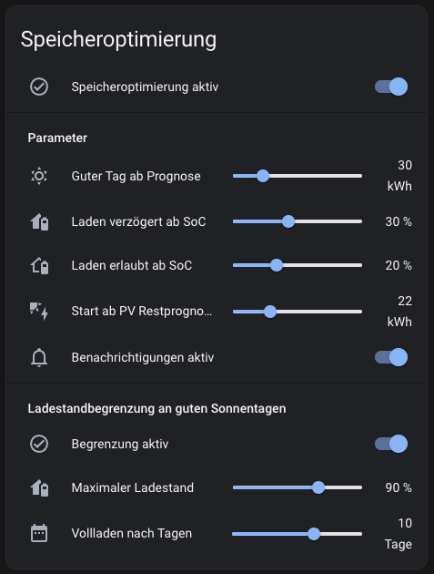
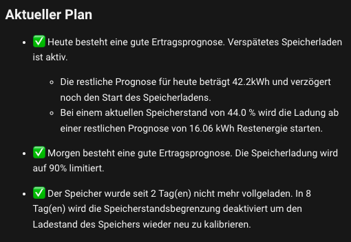

# Speicheroptimierung

Ziele dieser Speicheroptimierung sind:

- Verlängerung der Batterielebensdauer durch reduzierte 100% Zeiten:
  - Verzögertes Aufladen, damit der Speicher nicht schon am Morgen voll ist und nur auf den Abend wartet um entladen zu werden.
  - An Tagen mit ausreichend Ertrag wird der maximalen Ladestand limitiert. Dabei wird jedoch sichergestellt, dass nach einigen Tagen doch wieder auf 100% geladen wird damit das Batterie Management des Speichers den Ladestand wieder kalibrieren kann und die Zellen ausbalanciert werden. Dies ist besonders für Lithium Eisenphosphat (LFP) Batterien wichtig, wegen ihrer sehr flachen Spannungskurve.
- EVCC wird während dessen so gesteuert, dass parallel mit Überschuss ladende Fahrzeuge optimal geladen werden.
- Ein etwas netzdienlicheres Verhalten. Morgens kann noch eingespeist werden. Erst zum späten Nachmittag wird der Speicher geladen - dann wenn die meisten anderen PV Anlagen einspeisen.
- Optionale Begrenzung der maximalen Lade- und Entladeleistungen (siehe [Heimspeicher steuern](../heimspeicher-steuern/README.md)).

Was diese Steuerung (derzeit noch) nicht kann:
- Regelung nach Stromspitzengesetz: Überschuss über mehr als 60 Prozent in den Speicher laden.
- Laden bei negativen Strombörsenpreisen.

## Beschreibung

Moderne Energiemanagementsysteme nutzen zum Teil KI und Machine Learning um den Verbrauch des Hauses zu lernen und um den Speicher zu steuern. Mit dieser Steuerung verbleibt die volle Kontrolle beim Benutzer - dies erfordert allerdings einige Parameter, die recht individuell sind. Diese sind abhängig von

- Hausverbrauch und typisches Verbrauchsverhalten der Bewohner.
- Verhältnis von PV Leistung zu Speichergröße, sowie die Ausrichtung der PV Anlage.

Um die Parameter einzustellen wird hier eine [Karte](#steuerung) bereitgestellt, um alle Parameter bequem einstellen zu können.



Hier sieht man Beispielsweise meine Einstellungen für eine PV Anlage mit 9,84 kWp, die nach Süden ausgerichtet ist mit einem Speicher von 10 kWh, der auf eine Entladegrenze von 10% eingestellt ist. Mit diesen Einstellungen wurde bisher mein Speicher jeden einzelnen Tag rechtzeitig voll. Wie sich dies im Winter bewährt, wird sich noch sehen lassen.

Die Einstellungen im Einzelnen:

| Parameter | Beschreibung |
| --------- | ------------ |
| Speicheroptimierung aktiv | Wenn an, wird die Speicherladung optimiert. |
| Guter Tag ab Prognose     | Der Ertrag in kWh, ab wann man von einem ausreichend guten Tag reden kann, der einen guten Autarkiegrad ergibt, während der Speicher noch sicher vollgeladen wird.<br>Anhand dieses Wertes wird entschieden ob eine verzögerte Speicherladung an diesem Tag überhaupt durchgeführt wird, oder ob das Wetter eher zu unbeständig ist. Es könnte ja sein, das früh am morgen zwar die Sonne scheint, später das Wetter jedoch umschlägt. Dann würde der Speicher nicht mehr voll werden.<br>Darüber hinaus wird die Ladestandsbegrenzung ignoriert, wenn die Prognose für den nächsten Tag unter diesem Wert liegt, denn man wird womöglich am nächsten Tag jede kWh aus dem Speicher benötigen. |
| Laden verzögert ab SoC    | Ab diesem Ladestand wird verzögert. Ist der Ladestand bei Sonnenaufgang darüber wird die weitere Ladung deaktiviert. Ist der Ladestand bei Sonnenaufgang noch darunter wird zunächst auf diesen Ladestand geladen. Er sollte hoch genug gewählt sein, damit der Speicher eventuelle Verbrauchsspitzen, die nicht von der PV ausgeglichen werden können (z.B. Kochen am Mittag) abdecken kann. |
| Laden erlaubt ab SoC      | Sollte während das Laden noch verzögert wird, der Speicher zu startk abfallen, wird die Speicherladung ab diesem Ladestand wieder erlaubt. Dann wird wieder bis zum 'Laden verzögert ab SoC' Ladestand geladen. Entsprechend muss dieser Ladestand niedriger gewählt werden. Er sollte etwas über der Entladegrenze des Speichers liegen (zum Beispiel, wenn die Entladegrenze bei 20% liegt, dann sollte dieser Wert bei mindestens 25% liegen) |
| Start ab PV Restprognose  | Ab dieser restlichen Prognose würde die Ladung des Speicher gestartet werden, wenn er von 0% auf 100% geladen werden würde. Der Wert sollte also so gewählt werden, dass neben der Speicherladung auch noch der Hausverbrauch locker abgedeckt wird. Hierbei sollte man vom Worst Case ausgehen, also zum Beispiel es wird gebacken, während Spülmaschine, Waschmschine und Trockner läuft. Dieser Wert lässt sich am besten durch probieren herausfinden. Am besten startet man als Faustregel mit 2.5 x Speicherkapazität (bei einem 10 kWh Speicher, also 25 kWh Restprognose) und reduziert dann wenn man merkt, dass der Speicher auch später geladen werden könnte.<br>Desto höher der Ladestand ist, desto mehr wird der Start automatisch anteilhaft verzögert. Muss der Speicher also z.B. nur um 50% geladen werden, wird die Ladung erst ab einer kleineren Restprognose gestartet.|
| Benachrichtigungen aktiv  | Während man die Werte noch einstellt kann man sich zur besseren Überwachung Benachrichtungen über die Home Assistant Companion App schicken lassen. Wenn die Werte einmal gut eingestellt sind, kann man diese Benachrichtigungen mit diesem Schalter abschalten |
| Begrenzung aktiv          | Aktiviert die Ladestandsbegrenzung zum eingestellten Wert. Wenn abgeschaltet wird immer auf 100% geladen |
| Maximaler Ladestand       | Der Ladestand auf den der Speicher maximal geladen werden soll, vorausgesetzt der nächste Tag hat eine ausreichend gute Prognose. |
| Vollladen nach Tagen      | Nach dieser Anzahl an Tagen wird der Speicher mindestens einmal auf 100% geladen, damit das Batteriemanagement wieder den Ladestand der LFP Zellen kalibrieren kann. Dies kann gerade im Sommer während vieler guten Sonnentage in Folge vorkommen.<br>Im Winter kann nun das Gegenteil eintreten. Gerade nach den Tagen mit begrenzter Ladung schlägt das Wetter um und der Speicher wird nicht mehr voll. Dann wird spätestens nach 30 Tagen eine Vollladung aus dem Netz erzwungen. |

Weiterhin lassen sich die maximalen Lade- und Entladeleistungen begrenzen (siehe [Heimspeicher steuern](../heimspeicher-steuern/README.md)). Ich begrenze so die maximalen Ladeleistung auf 4 kW um EVCC bei guter Abendsonne parallel noch zu erlauben ein angeschlossenes Auto mit Überschuss zu laden, da sonst recht häufig die Mindestleistung für das Autoladen von 1.4 kW nicht erreicht wird und dann während der Batterieladung eingespeist wird.

## Abhängigkeiten

- [Heimspeicher steuern](../heimspeicher-steuern)
- [Solcast PV Prognose](https://github.com/BJReplay/ha-solcast-solar) (Die Forecast.Solar Integration von Home Assistant liefert viel zu schlechte Prognosen)
- Home Assistant Companion App auf dem Smartphone, um Benachrichtigungen zu erhalten.
- Optional: [EVCC MQTT Integration](../../../installation/evcc-mqtt-integration/)

## Helfer

[Grundlagen um Helfer zu erstellen](../../../README.md#helfer).

Für die Automatisierungen müssen die folgenden [Helfer](../../../README.md#helfer) angelegt werden:

### Wechselrichter spezifische Helfer

Lege die Helfer für den entsprechenden Wechselrichter aus den Unterordnern an:
- [Sofar Solar](./sofar-solar-HYD-x-KTL/README.md)


## Skripte

### Passive Mode Werte Setzen

[`passive-mode-werte-setzen.yaml`](./scripte/passive-mode-werte-setzen.yaml)

#### Notwendige Anpassungen
- `<companion_app_device_name>` Der Gerätename Deines Smartphones auf dem die Companion App läuft um Benachrichtigungen zu erhalten.


## Automatisierungen

[Grundlagen um Automatisierungen zu erstellen](../../../README.md#home-assistant-artefakte).


### Passive Mode überwachen und ggf. Werte neu setzen

[`./automatisierungen/werte-überwachen-neu-setzen.yaml`](./automatisierungen/werte-überwachen-neu-setzen.yaml)

Sollten sich die durch den Helfer eingestellten Werte durch irgendwelche anderen Einflüße ändern und entsprechen sie nicht mehr den zu erwartenden Werten, dann werden die Werte neu gesetzt und eine Benachrichtigung verschickt.

#### Notwendige Anpassungen
- `<companion_app_device_name>` Der Gerätename Deines Smartphones auf dem die Companion App läuft um Benachrichtigungen zu erhalten.


## Lovelace Karten

### Steuerung

Eine Karte um die Speicheroptimierung zu steuern und um die Parameter einzustellen:


Um diese Karte zu erstellen sind folgende Schritte durchzuführen:

1. Füge zu einem Dashboard eine neue 'Entitäten' Karte hinzu.
2. Clicke unten rechts auf Code Editor Anzeigen.
3. Ersetze den Inhalt im Code Editor durch untenstehenden Code.

```yaml
type: entities
entities:
  - entity: input_boolean.helper_speicheroptimierung_ein
    name: Speicheroptimierung aktiv
  - type: conditional
    conditions:
      - entity: input_boolean.helper_speicheroptimierung_ein
        state: "on"
    row:
      type: section
      label: Parameter
  - type: conditional
    conditions:
      - entity: input_boolean.helper_speicheroptimierung_ein
        state: "on"
    row:
      entity: input_number.helper_speicheroptimierung_limit_guter_tag_prognose
      name: Guter Tag ab Prognose
  - type: conditional
    conditions:
      - entity: input_boolean.helper_speicheroptimierung_ein
        state: "on"
    row:
      entity: input_number.helper_speicheroptimierung_soc_laden_deaktivieren
      name: Laden verzögert ab SoC
  - type: conditional
    conditions:
      - entity: input_boolean.helper_speicheroptimierung_ein
        state: "on"
    row:
      entity: input_number.helper_speicheroptimierung_min_soc_laden_aktivieren
      name: Laden erlaubt ab SoC
  - type: conditional
    conditions:
      - entity: input_boolean.helper_speicheroptimierung_ein
        state: "on"
    row:
      entity: input_number.helper_speicheroptimierung_pv_restenergie_kwh
      name: Start ab PV Restprognose
  - type: conditional
    conditions:
      - entity: input_boolean.helper_speicheroptimierung_ein
        state: "on"
    row:
      entity: input_boolean.helper_speicheroptimierung_benachrichtigungen
      name: Benachrichtigungen aktiv
  - type: conditional
    conditions:
      - entity: input_boolean.helper_speicheroptimierung_ein
        state: "on"
    row:
      type: section
      label: Ladestandbegrenzung an guten Sonnentagen
  - type: conditional
    conditions:
      - entity: input_boolean.helper_speicheroptimierung_ein
        state: "on"
    row:
      entity: input_boolean.helper_speicheroptimierung_limit_ein
      name: Begrenzung aktiv
  - type: conditional
    conditions:
      - entity: input_boolean.helper_speicheroptimierung_ein
        state: "on"
      - entity: input_boolean.helper_speicheroptimierung_limit_ein
        state: "on"
    row:
      entity: input_number.helper_speicheroptimierung_limit_soc_grenze
      name: Maximaler Ladestand
  - type: conditional
    conditions:
      - entity: input_boolean.helper_speicheroptimierung_ein
        state: "on"
      - entity: input_boolean.helper_speicheroptimierung_limit_ein
        state: "on"
    row:
      entity: input_number.helper_speicheroptimierung_batterie_ladelimit_max_tage
      name: Vollladen nach Tagen
title: Speicheroptimierung
```

### Aktueller Plan

Eine Karte, die eine Zusammenfassung anzuzeigen, was anhand der aktuellen Einstellungen passieren wird:



Um diese Karte zu erstellen sind folgende Schritte durchzuführen:

1. Füge zu einem Dashboard eine neue 'Markdown' Karte hinzu.
3. Ersetze den Inhalt der Markdown-Karte durch untenstehenden Code.

```markdown
## Aktueller Plan 

  
      
- ✅ Heute besteht eine gute Ertragsprognose. Verspätetes Speicherladen ist aktiv.

  - Die restliche Prognose für heute beträgt {{ states('sensor.solcast_pv_forecast_forecast_remaining_today') | round(1) }}kWh und verzögert noch den Start des Speicherladens.
  - Bei einem aktuellen Speicherstand von {{ states('sensor.helper_speicheroptimierung_bat_soc') }} % wird die Ladung ab einer restlichen Prognose von {{ states('sensor.helper_speicheroptimierung_restenergie_aktuell') }} kWh Restenergie starten.
      
- ✅ Die Speicherladung ist heute verzögert gestartet geworden dank einer guten, heutigen Ertragsprognose.
      
  
- ⛔️ Heute besteht eine schlechte Ertragsprognose. Verspätetes Speicherladen ist deaktiviert um eine Aufladung zu gewährleisten.
  
  
    
- ✅ Morgen besteht eine gute Ertragsprognose. Die Speicherladung wird auf {{ states('input_number.helper_speicheroptimierung_limit_soc_grenze') | int }}% limitiert. 
    
- ⛔️ Morgen besteht eine schlechte Ertragsprognose. Der Speicher wird auf 100% geladen.
    
    
- ✅ Der Speicher wurde seit {{ states('input_number.helper_speicheroptimierung_batterie_nicht_voll_zahler') | int }} Tag(en) nicht mehr vollgeladen. In {{ states('input_number.helper_speicheroptimierung_batterie_ladelimit_max_tage') | int - states('input_number.helper_speicheroptimierung_batterie_nicht_voll_zahler') | int }} Tag(en) wird die Speicherstandsbegrenzung deaktiviert um den Ladestand des Speichers wieder neu zu kalibrieren.
    
- ⛔️ Da der Speicher seit {{ states('input_number.helper_speicheroptimierung_batterie_nicht_voll_zahler') | int }} Tagen nicht mehr vollgeladen wurde, ist die Speicherstandsbegrenzung nun deaktiviert damit die Zellen wieder ausbalanziert werden und der Ladestand kalibriert wird. Spätestens in {{ 30 - states('input_number.helper_speicheroptimierung_batterie_nicht_voll_zahler') | int }} Tag(en) wird der Speicher einmal aus dem Netz geladen, wenn er bis dahin nicht voll geworden ist.
    
  
- ⛔️ Ladestandsbegrenzung ist ausgeschaltet. Der Speicher wird auf 100% geladen.
   

⛔️ Speicherschonendes Laden ist ausgeschaltet.

```